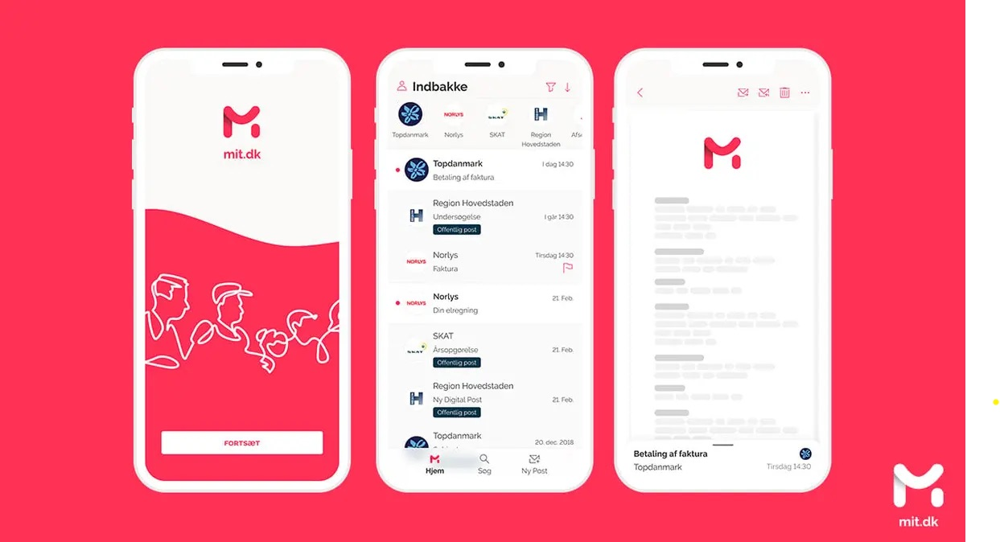
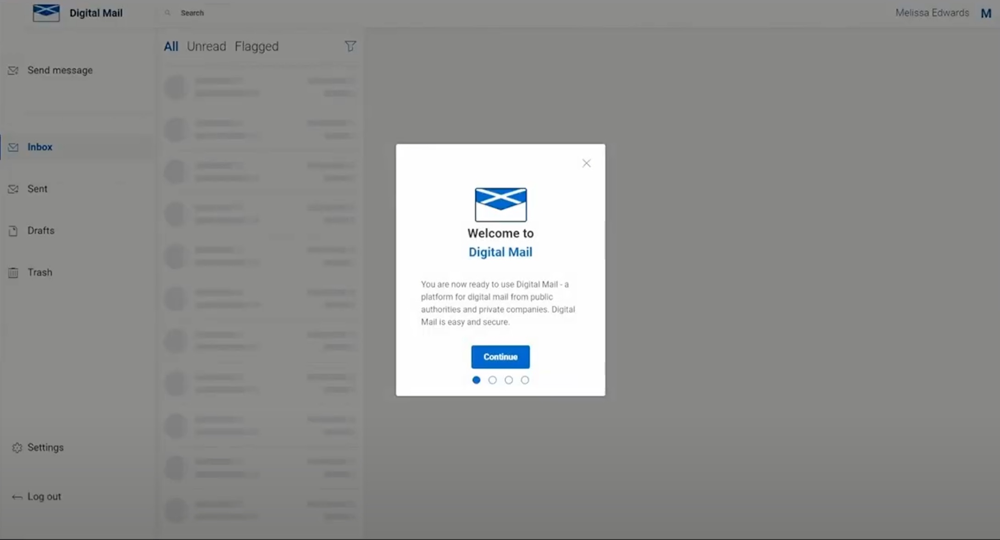

## Where has this work come from?
Other countries, including Denmark, have a National Digital Post enabling cross-government and direct two-way communication for citizens and public authorities. This meets legal requirements around the delivery and receipt of official communications while enhancing the user experience. It is a keystone technology that provides several multiplier effects and a level of efficiency that allows a highly responsive and even proactive approach to government delivery of services.

##
Working with the main supplier responsible for the Danish Digital Post, this project and design history aims to document the work done to validate the ability of such a system to fit within the GDS landscape.

## GDS
This project fits into the broader plan to develop government platforms through GDS, especially with the Platform as a Service (PaaS) approach. It’s part of the ongoing push to build and roll out "Government as a Platform," which is a big step in the UK’s journey toward digital transformation.

### Platform as a service strategy
- An [ongoing strategy](https://gds.blog.gov.uk/2021/02/22/government-as-a-platform-gaap-milestones/) to build and deliver Government as a Platform
- https://gds.blog.gov.uk/2015/03/29/government-as-a-platform-the-next-phase-of-digital-transformation/
- An existing landscape of [platforms and services](https://www.gov.uk/service-toolkit#gov-uk-services)

### Big bets
- [Mailbox as a GDS Big bet](https://app.mural.co/t/gaap0347/m/gaap0347/1693566803138/ca3da8b0f9f5cadb7fcaa16a2484bf508da47c38?sender=3a2a9b68-f8bd-4c84-8bf4-5d74fbc39e5b)

## Danish mailbox
The [Danish National Digital Post](https://en.digst.dk/systems/digital-post/) solves a number of user needs on both sides of the platform, for citizens, departments & services.

### Overview
- Since 2014, it has been mandatory for all citizens over 15 years old and businesses to use Digital Post unless they have been exempted
- The mailbox uses [MitID](https://www.mitid.dk/en-gb/) for secure login and identity verification, ensuring that only the intended recipient can access the information
- Citizens can access Digital Post through various platforms, including the official Digital Post website, Borger.dk, and e-Boks

As the mailbox was one of the starting points for digitisation it serves a number of core mailbox functions but also uses the mailbox as a platform to solve interconnected needs, including complete service journeys.

- Statutory requirement for legal documents
- Forms and transactional services

## Scottish mailbox
Working with the underlying platform a mailbox is being tested in Scotland.

This mailbox follows the same design pattern as the Danish mailbox.

[Information from Scotland Civtech](https://www.civtech.scot/demo-day-9-netcompany)

## Additional links
- [What is Digital Post](https://lifeindenmark.borger.dk/apps-and-digital-services/Digital-Post)
- [Denmark Principles for Digital Inclusion](https://en.digst.dk/media/31496/principles-for-digital-inclusion-eng.pdf)
