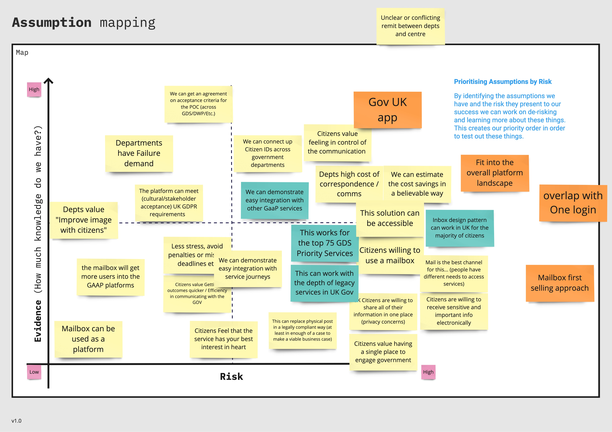

## Team assumptions mapped

With our team we ran a workshop to identify the riskiest assumptions for the mailbox

## Design risk
There are a number of assumptions that we need to know more about in order to lower the risk to implementation. Specifically the following were identified as the ones with the highest risk:

- **Channel desirability** The mailbox as a new channel aligns with citizen's needs, preferences and behaviours
- **Design paradigm accessibility** A standardised inbox design pattern can work for the majority of users meeting GOV.UK standards for accessibility, usability and inclusion
- **GDS design system compatibility** The mailbox can work with existing GDS design patterns
- **Channel integration** It can integrate easily with the other existing services and GDS platforms to create a cohesive and consistent citizen experience

## Assumption log
We have [documented all of the assumptions](https://docs.google.com/presentation/d/1kkxeAmjPUcKCrCeNbkAbzrtym1kPWieg2IAAxOYr81M/edit#slide=id.g2f30d30327d_0_63) within the project in a document to log them
