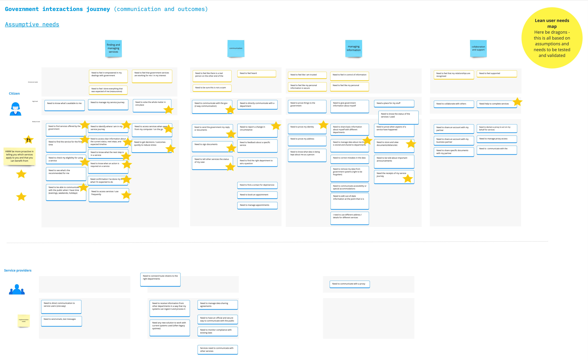

[User needs Miro board](https://miro.com/welcomeonboard/NVkydW5xNDhvVFh3ZHBQdW9qWHFxeU56MGxhRklXNFVPZ0hsQmZUVXhXeTVkT1k3MjVyN21XcFZYVUl2Z25pVHwzMDc0NDU3MzQ3NTkwNjk5ODAxfDI=?share_link_id=98136674020)
## User needs map
Understanding the journey around communication gives us a framework to strategically design the experience for citizens

## Key users
### Citizens
We currently don’t have any meaningful division of citizens and their communication needs other than general assumptions. This is something we will explore in further research
- Possible that people may need to communicate differently within the country versus outside of the country (currently a pain point without a digital mailbox)

### Service providers

This could be whole departments, specific services or even local authorities

## Scope of journey
Working to understand a linear journey is something that will evolve over time
Start point - not communicating with the government
Endpoint - no longer communicating with the government (e.g. renunciation of citizenship, death)
