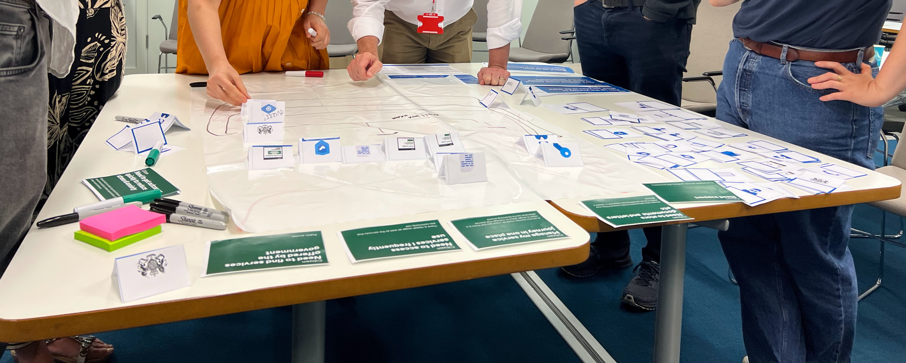

## Goals for workshop
Internally we realised that there are overlapping needs with a new channel and decided the best way to de-risk that was to attempt to look at that journey together with GDS.

Our goals were to:

- De-risk engagement and open up collaboration with GDS and platform teams
- Build alignment and understanding of the mailbox concept and its role in solving user needs
- Develop a holistic view of systems and their connection to the citizen’s journey
- Identify challenges, opportunities, and document a clearer view of the landscape

## Focusing on citizen journey across the landscape

## Key learnings
- Cross-cutting journey design is difficult - Currently it’s difficult to design experiences and needs across the platforms, despite each team solving their user needs well
- Preference for current channels - It was difficult to keep framed in communication needs and not to try to solve problems with the existing platforms and services
- Mailbox is an important channel but it isn’t completely clear to all teams what the capabilities are
- Questions around data-sharing/data model were key barriers to the overall experience
- Backlogs/roadmaps of platforms were not well understood and not transparent

All of the services do an excellent job serving the needs of users but this is all done in parallel. The user journey across the platforms doesn’t seem well understood and not often designed intentionally

Recommendation Address this in smaller design sessions with the overlapping needs we have, including other platform solutions and other departments, including but not limited to DWP. This would include us creating clearer scenarios that are core to the needs of communication

It was difficult to keep the teams framed in the specific mail channel and communication needs and not to try to solve problems with the existing platforms and services

Recommendation Creating more clarity and research around the core communication needs will be key to making the mailbox concept more real and integrating it into the landscape

Identity is a core part of the mailbox solution overlapping with One-login. This risk was identified and has been taken forward by the technical team

Recommendation Gain a clearer understanding of the research One-login have done on the needs for citizen identity, document initial platform solution from Lasse, do additional primary research on the connection of identity needs in relation to communication, including the citizen and departmental needs

## Channel strategy
A key part is that there is no overarching channel strategy

## Possible risks and concerns
- Customer Overwhelm: DWP concerned about overwhelming customers with multiple communications.
- Common Infrastructure: Challenges in communicating the benefits of digitising mail and technical aspects.
- Role of One Login: Lack of understanding about One Login’s role in supplying identities to Mailbox.
- Secure Communication: General misunderstanding of Mailbox as a secure communication channel, DWP highlighted the aversion to sending sensitive information via email

## Further questions
- Would users see this as just email or something different?
