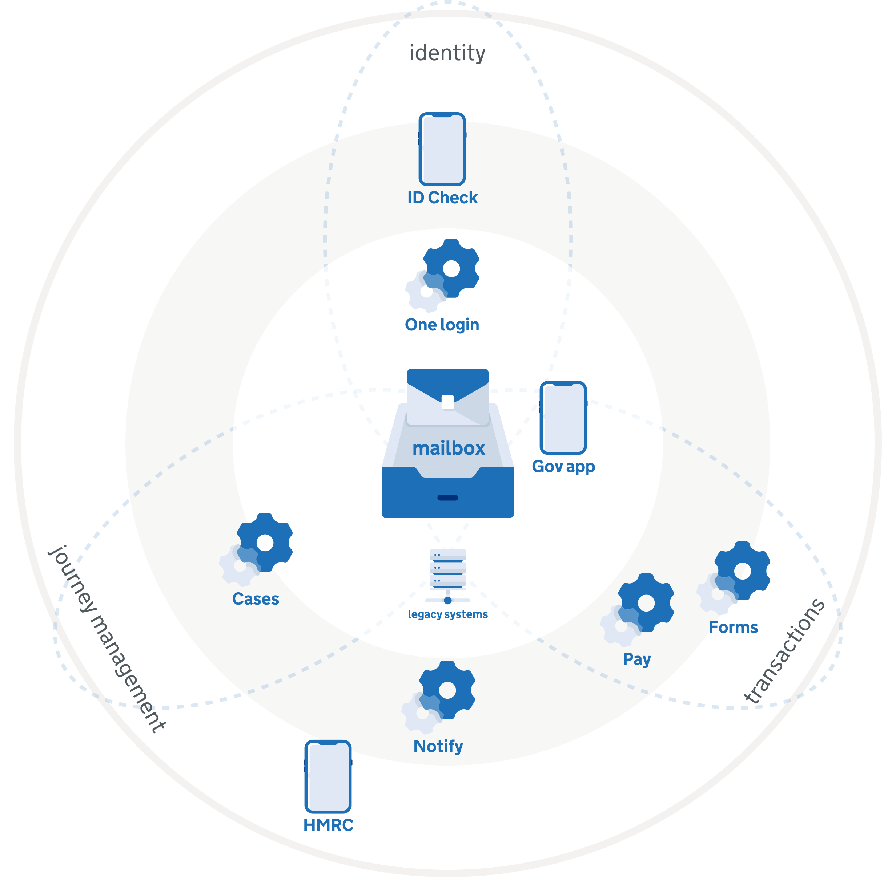
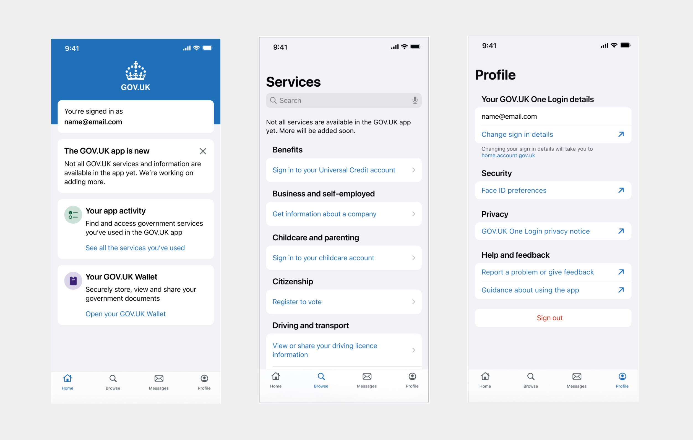

## Overview

## Apps

### Gov UK app

[Gov UK App design history](https://miro.com/app/board/uXjVK4dX-IM=/?moveToWidget=3458764594986092314&cot=14)

#### User needs
These are some of the user needs the app is solving
- Access government documents
- Stay informed about government events
- Find government services that I'm eligible for
- Access and use government services
- Store gov documents digitally
- Share gov documents
